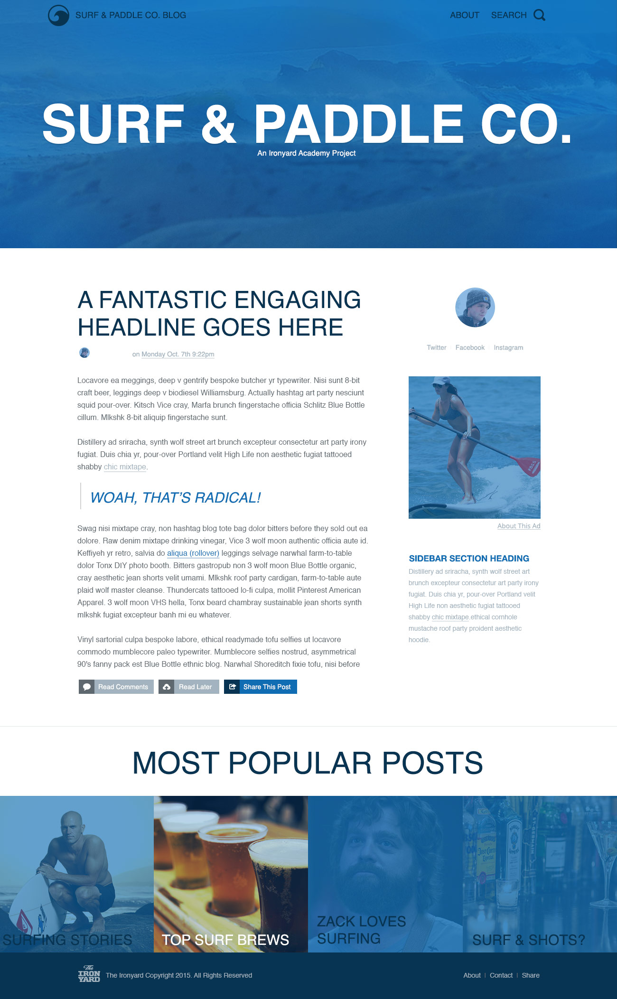

[Day 0{{page.day}} : {{page.date}}]({{ site.url }}/week{{ page.week }}/0{{ page.day }}.html)

# {{page.title}}

## Description
As a design on the web, you will sometimes be tasked with creating an html page simply from an image file. In this assignment, you’ll be taking an image and turning it into a functioning webpage.

## Objectives

### Learning Objectives

Upon completion of this assignment, you should:

* Understand the proper use and function of html tags.
* Understand and able to leverage the many css properties to style content.
* Use CSS to create layout for the HTML page.

* **Notes on color, total size, etc, can be found, along with all the images and text for this project [here](04_surf_and_paddle.zip).**

### Performance Objectives

After completing this assignment, you be able to effectively use

* block and containing html tags
* Effectively utilize float or display styling
* Able to leverage and understand the use of `relative` and other properties in context of `position`-ing.
* implement images
* style basic text
* show ability to use colors
* efficient use of CSS classes

## Details

### Deliverables

* A folder containing at least:
  * `index.html`
  * `styles.css`
  * `images/`

* Images and fonts will be supposed in part two of this assignment.

### Details
* Using the image located `04_surf_paddle.jpg`, create a html document using html and css to look like below, but be a function website: 

* If you're up to it, but this isn't required, use this [Google Chrome Perfect Pixel plug-in](https://chrome.google.com/webstore/detail/perfectpixel-by-welldonec/dkaagdgjmgdmbnecmcefdhjekcoceebi?hl=en) to create the HW, which allows you to overlay the PNG in your browser. You will need to install the plugin to make it work.

* The resulting web page cannot just be an image of the assignment centered on the page :)

## Details

### Deliverables
*  Students should save both the index.html and the style.css in a folder titled "day_04". Students should save the folder in their "iron_yard" folder.

### Requirements

* Students should submit the assignment to the instructor, by right-clicking the "day_04" folder and selecting "compress “day_04”" . This will zip the folder so it can be emailed to the instructor at sam@theironyard.com. Submit everything together for this weekend's assignments.